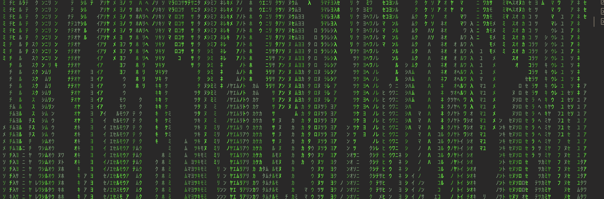

# Gotrix / Matrix Animation 💻

A customizable terminal animation that simulates the iconic "digital rain" effect from The Matrix. This project is built in Go and uses ANSI escape codes to render a dynamic, color-fading character stream directly in your terminal, providing a lightweight and visually engaging experience.



## ✨ Features

- **Customizable:** Change the character set, color theme, speed, and density of the drops.
- **Dynamic:** The animation responds to terminal resizing in real-time.
- **Efficient:** It only renders the parts of the screen that change, ensuring smooth performance.
- **Multiple Character Sets:** Choose from predefined sets like binary, emojis, or Kanji, or create your own.
- **Predefined Color Themes:** A variety of color options are available to match your style.

## ⚙️ How to Run

### Prerequisites

- Go 1.16 or higher installed on your system.

### Running from source

1.  **Clone the repository:**
    ```bash
    git clone https://github.com/hugomf/hugo_rain.git
    cd your-repo-name
    ```

2.  **Run the application:**
    ```bash
    go run main.go
    ```

### Command-line Flags

You can customize the animation using the following flags:

-   `--color [name]`
    -   Sets the color theme.
    -   **Available Colors:** `green` (default), `amber`, `red`, `orange`, `blue`, `purple`, `cyan`, `pink`, `white`.
    -   **Example:** `go run main.go --color blue`

-   `--chars [name|string]`
    -   Specifies the character set to use.
    -   **Available Sets:** `matrix` (default), `binary`, `symbols`, `emojis`, `kanji`, `greek`, `cyrillic`.
    -   You can also provide a custom string of characters.
    -   **Example:** `go run main.go --chars "👾🤖👽"` or `go run main.go --chars kanji`

-   `--speed [milliseconds]`
    -   Controls the animation speed. Lower values mean faster animation.
    -   **Range:** `10` to `500`.
    -   **Example:** `go run main.go --speed 50` (very fast)

-   `--density [value]`
    -   Adjusts the number of drops on the screen. Higher values result in more drops.
    -   **Range:** `0.1` to `3.0`.
    -   **Example:** `go run main.go --density 1.5` (heavy density)

-   `--list`
    -   Displays all available colors and character sets, along with recommended flag values.
    -   **Example:** `go run main.go --list`

### Example Usage

```bash
# Run with a fast, blue-colored binary drop
go run main.go --color blue --chars binary --speed 50

# Run with a heavy density of emojis
go run main.go --chars emojis --density 2.0

# Run with a custom character set and amber color
go run main.go --color amber --chars "░▒▓█"
