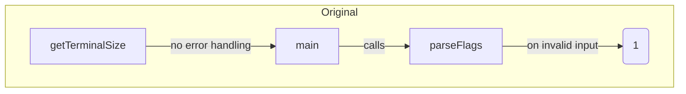
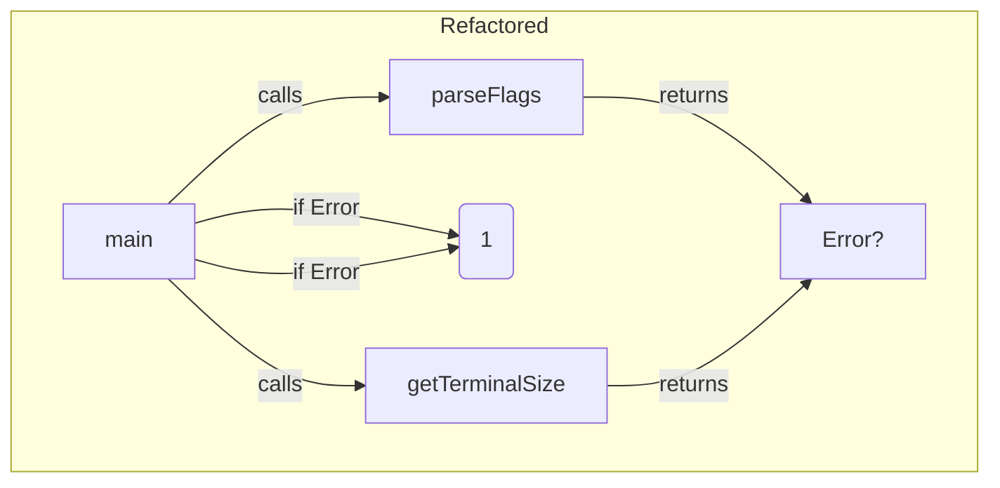

### Refactoring Report: Phase 2 - Code Quality & Best Practices

This document summarizes the improvements made to the `matrix.go` codebase during Phase 2 of the code review. The primary goal of this phase was to enhance **robustness** and adhere to **idiomatic Go error handling patterns**.

-----

### 1\. Codebase Summary Before Changes

In the previous version, error handling was simple but not idiomatic. Functions like `parseFlags` would print an error message and immediately terminate the program using `os.Exit()`. This approach is inflexible and makes it difficult for a calling function to handle the error in a different way, such as logging it or attempting a recovery. Similarly, the `getTerminalSize` function did not handle potential errors from its underlying system call.

-----

### 2\. Implemented Changes

#### **A. Idiomatic Error Propagation**

  * **Change:** The `parseFlags()` and `getTerminalSize()` functions have been modified to **return an `error` value** instead of calling `os.Exit()`.
  * **Reasoning:** This aligns the code with the standard Go practice of `return value, error`. By returning an error, a function gives its caller control over how to handle a failure. The responsibility for terminating the program now resides solely in the `main` function, which is the appropriate place for it. This makes the `parseFlags` function more reusable and the overall code more modular.

#### **B. Centralized Error Handling in `main`**

  * **Change:** The `main` function now explicitly **checks for errors** returned by `parseFlags()` and `getTerminalSize()`. If an error occurs, it prints a formatted error message to the user and then calls `os.Exit(1)`.
  * **Reasoning:** This consolidates all application-level error handling and termination logic into a single place. The `main` function acts as the "cleanup crew," ensuring that any problems during initialization are handled gracefully before the main loop begins.

-----

### 3\. Architectural Diagrams

The following diagrams illustrate the changes in control flow and responsibility, specifically for error handling.

#### **Before Refactoring**

#### **After Refactoring**

