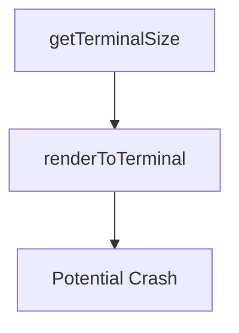
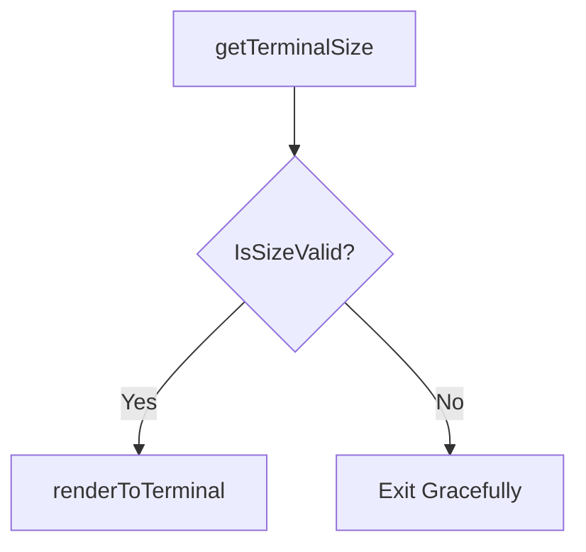
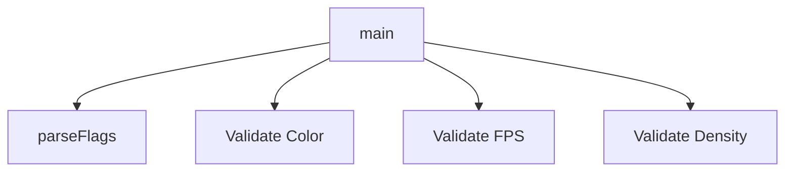
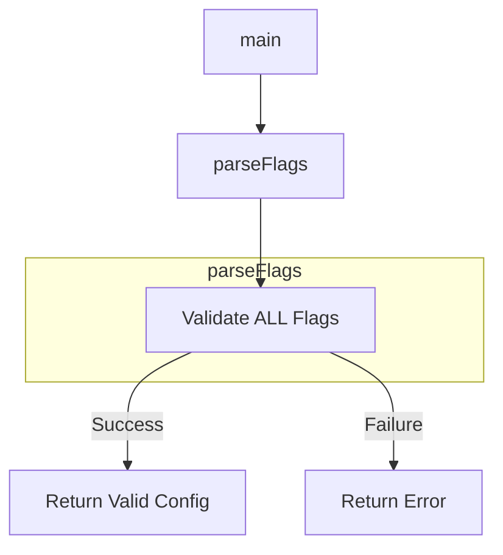

Sure! Here's your content converted to clean, well-structured **Markdown** format, including properly embedded **Mermaid diagrams**:

---

# Summary of Changes with Mermaid Diagrams

This document visually outlines the key changes and improvements implemented during the final two phases of the code review. These diagrams illustrate how the code's structure and logic were refined to be more robust and maintainable.

---

## Phase 3: Robustness & Security

The primary goal of this phase was to handle potential points of failure, ensuring the application is resilient to unexpected conditions like an invalid terminal size.

### Before

The application would attempt to render immediately after getting terminal dimensions, which could lead to a crash if the size was invalid.

### After

An explicit validation step was added. The application now checks the terminal size and exits gracefully if the dimensions are invalid, preventing a crash.

---

## Phase 4: Refining Main Function, Flags, and Configuration

This phase focused on centralizing configuration validation to make the code cleaner and more robust.

### Before
Validation for different flags was scattered across the main function after the flags were parsed.

### After

All flag validation was consolidated into a single `parseFlags` function. The `main` function now receives a single, fully-validated `Config` struct or an error.

---
