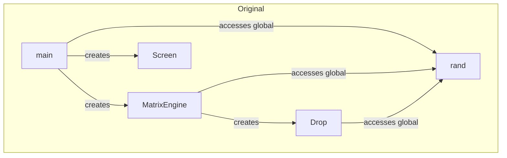
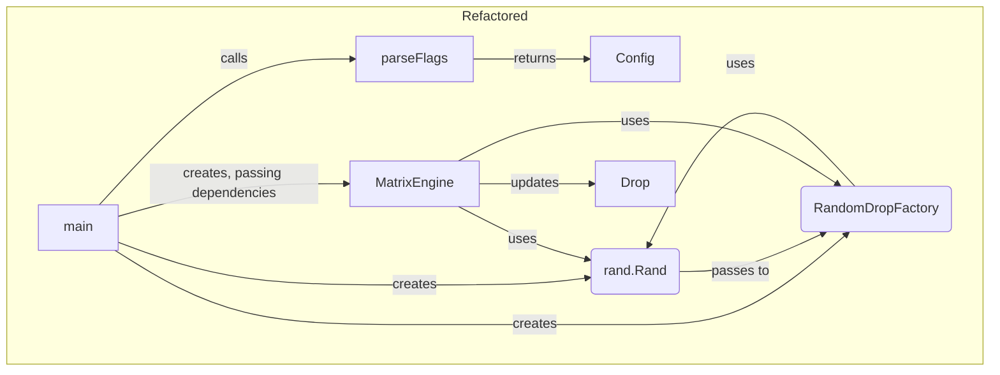

### Refactoring Report: Phase 1 - Architecture & Design Analysis

This document summarizes the architectural and design improvements made to the `matrix.go` codebase during Phase 1 of the code review. The primary goal of this phase was to enhance the code's **separation of concerns** and **modularity** through the application of key design patterns.

-----

### 1\. Codebase Summary Before Changes

The original codebase had a functional but tightly-coupled structure. The `main` function was responsible for all aspects of the application's lifecycle, including flag parsing, input validation, object creation, and the main animation loop. Furthermore, the `MatrixEngine` was responsible for creating its own `Drop` objects, which led to a form of code duplication and reduced flexibility.

-----

### 2\. Implemented Changes

#### **A. Centralized Configuration Management**

  * **Change:** Extracted flag parsing and input validation logic from the `main` function into a new, dedicated function called `parseFlags()`. This function now returns a `Config` struct.
  * **Reasoning:** This improves the **separation of concerns** by isolating the user input handling from the core application logic. The `main` function is now cleaner and more focused on its primary role: orchestrating the application's components.

#### **B. Dependency Injection for `rand.Rand`**

  * **Change:** The `*rand.Rand` instance is no longer accessed via the global `rand` package. Instead, it is created in `main` and passed as a dependency to the `NewMatrixEngine` constructor. `MatrixEngine` then passes it to its methods and the `Drop` update method.
  * **Reasoning:** This is a fundamental step towards **testability** and **modularity**. By injecting the random number generator, we can use a deterministic seed in tests to produce predictable results, making it much easier to verify the correctness of the animation logic.

#### **C. Factory Method and Dependency Injection for `Drop` Creation**

  * **Change:**
    1.  Introduced a new `DropFactory` interface with a `CreateDrop` method.
    2.  Implemented a concrete `RandomDropFactory` that encapsulates the logic for creating drops with random properties.
    3.  Modified the `MatrixEngine` to accept a `DropFactory` as a dependency in its constructor.
    4.  Updated the `MatrixEngine.createDrops()` and `MatrixEngine.resizeDrops()` methods to use the injected factory instead of creating drops directly.
  * **Reasoning:** This is the most significant architectural improvement in Phase 1. It applies the **Factory Method pattern** and **Dependency Injection** to achieve the following:
      * **Reduced Coupling:** The `MatrixEngine` no longer needs to know the specifics of how a `Drop` is created. It just needs an object that can provide a new `Drop`.
      * **Centralized Logic:** All drop creation logic is now in one place (`RandomDropFactory`), which eliminates code duplication.
      * **Enhanced Extensibility:** This design makes it easy to introduce new types of drops (e.g., drops with different behaviors or properties) in the future simply by creating a new factory that implements the `DropFactory` interface.

-----

### 3\. Architectural Diagrams

The following diagrams illustrate the transition from the original, tightly-coupled architecture to the new, more modular design.

#### **Before Refactoring**

#### **After Refactoring**

